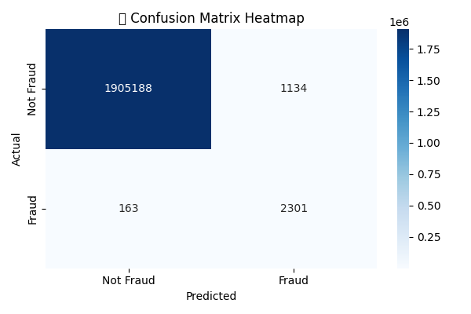
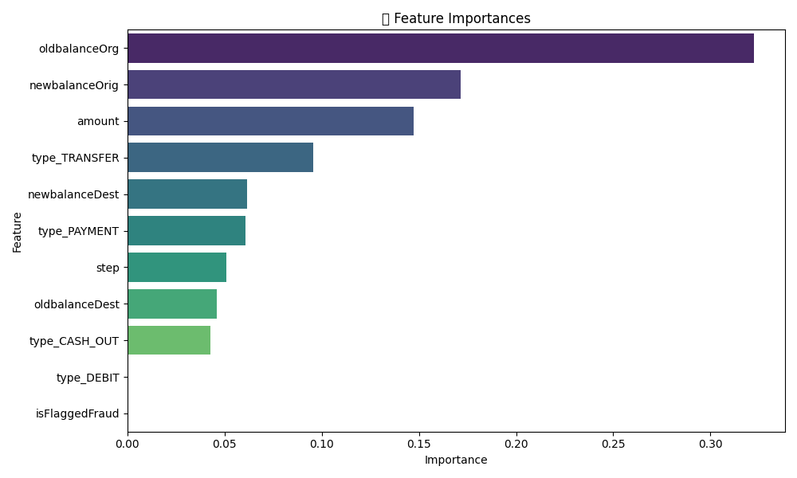

# 💳 Fraud Detection in Transactions (Machine Learning Project)

A machine learning project focused on identifying fraudulent financial transactions using a real-world dataset. This project is designed to demonstrate data preprocessing, handling class imbalance, model building, evaluation, and interpretation for a high-impact fraud detection use case.

---

## 📁 Dataset

- **Source**: [Kaggle – Fraud Detection](https://www.kaggle.com/datasets/ealaxi/paysim1)  
- **File Used**: `Transactions.csv`
- **Rows**: 6,369,434  
- **Columns**: 11 (after cleaning)  
- **Target Variable**: `isFraud` (0 = Not Fraud, 1 = Fraud)

---

## 📌 Problem Statement

Financial fraud is a serious concern in digital transactions. The goal is to build a classification model that can detect whether a given transaction is fraudulent or not using past transaction data.

---

## 🧪 Steps Followed

1. **Exploratory Data Analysis (EDA)**
   - Checked sample data, missing values, data types
   - Dropped non-informative columns (`nameOrig`, `nameDest`)

2. **Data Preprocessing**
   - One-hot encoded `type` column
   - Feature-target split
   - Train-test split with stratification

3. **Handling Class Imbalance**
   - Observed fraud rate: 0.12%
   - Used:
     - `class_weight='balanced'` in RandomForest
     - SMOTE (Synthetic Minority Over-sampling)

4. **Modeling**
   - Trained RandomForestClassifier
   - Evaluated with precision, recall, F1-score, confusion matrix

5. **Visualizations**
   - Confusion Matrix Heatmap
   - Feature Importances Bar Chart

---

## 📊 Visual Results

### ✅ Confusion Matrix Heatmap

Shows how well the model distinguishes fraud vs non-fraud.

---

### ✅ Feature Importances

Top features contributing to fraud detection.

---

## ✅ Results

- **Accuracy**: ~99.9%
- **Recall for Fraud Cases**: ~78%
- **F1 Score for Fraud**: ~87%
- Successfully improved fraud detection using SMOTE.

---

## 🧠 Key Learnings

- Class imbalance must be handled explicitly in fraud datasets.
- SMOTE and class-weight balancing help in capturing rare fraud cases.
- Visuals help in model explainability for business stakeholders.

---

## 🚀 Future Work

- Use XGBoost or LightGBM for improved recall
- Try anomaly detection algorithms (Isolation Forest, One-Class SVM)
- Deploy using Flask / Streamlit for real-time prediction

---

## 🛠️ Tools Used

- Python, Pandas, NumPy
- Scikit-learn
- imbalanced-learn (SMOTE)
- Seaborn, Matplotlib
- VS Code
## AUTHOR SHWETA ASHOK SWAIN 
## Contact 
linkedin- www.linkedin.com/in/shweta-swain01

email-shwetaswain01@gmail.com
